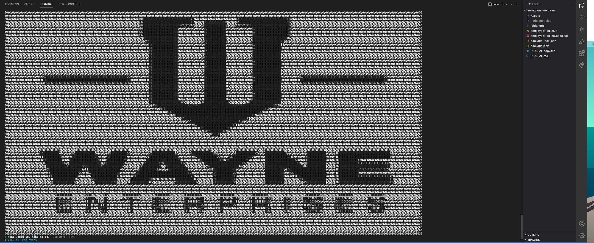

# Employee Tracker

## Background

This was a homework assignment for the UofT Bootcamp.  Below is the user story and the instructions for reference.

## Table of Contents
[User Story](#user-story)\
[Instructions](#instructions)\
[Technologies](#technologies)\
[License](#license)\
[Process](#process)\
[Screen Shot](#screen-shot)\
[Walkthrough Video](#walkthrough-video)


## User Story

```
As a business owner
I want to be able to view and manage the departments, roles, and employees in my company
So that I can organize and plan my business
```

## Instructions

Build a command-line application that at a minimum allows the user to:

  * Add departments, roles, employees

  * View departments, roles, employees

  * Update employee roles

## Technologies

* JavaScript
* Node.js
* Inquirer
* MySQL

## License

[MIT License](https://choosealicense.com/licenses/mit/)

## Process

* For this project we started from scratch, but we were given good instructions to get us going.  To start, I created the database, connected to it, and then seeded the database.
* Once I had some data to work with I created an initialize function that prompted the user using inquirer for what they would like to do with the database.
* Next I created the functions with the queries that were responsible for accomplishing the task the user had selected.  Some of these tasks require more user input which is accomplished using inquirer.
* Biggest challenge for this project was getting started.  To help with that I picked a business to model the project after, so I choose the fictional Wayne Enterprises from the DC Comic universe.  Once I picked Wayne Enterprises it was easy to seed the database and get cracking at the functionality of the application.  The biggest success was being able to create list choices in inquirer from the database by mapping over the table objects.
* Credit to my TA's, tutor, and classmates for their help with the project.

## Screen Shot



## Walkthrough Video

https://drive.google.com/file/d/1V4xSrw06gZcxhvyEu5vo6FTRyG1j8YKe/view